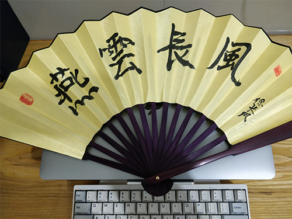

[](https://github.com/yanyunchangfeng/learn-ts-react/actions/workflows/test.yml/?query=branch:main) [](https://codecov.io/gh/yanyunchangfeng/learn-ts-react) [](https://github.com/yanyunchangfeng/learn-ts-react/actions/workflows/deploy.yml)

[](https://www.npmjs.com/package/learn-ts-react)

<p align="center">
    
</p>

## 介绍

你好，我是[燕云长风](https://yanyunchangfeng.github.io)。  
寓意：结合李白著名的边塞诗《关山月》取【燕云长风】—— 长风几万里，吹度玉门关。

## Hooks 的常见问题

## 对传统 React 编程的影响

1. 生命周期 函数如何映射到 Hooks？ [hookLifeCycle](src/components/LifeCycle/index.tsx) | [getDerivedStateFromProps](src/components/getDerivedStateFromProps.tsx)  
   -- shouldComponentUpdate 对应的就是 memo 组件了
2. 类实例成员变量如何映射到 Hooks？ [ref](src/components/LikeButton.tsx) -- ref 和直接一个对象有什么区别 ref 在所有的 render 当中都保持着唯一的引用 因此对 ref 的取值赋值 拿到的都是最终的状态
3. Hooks 中如何获取历史的 props 和 state？[Ref&useEffect](src/components/Counter.tsx)  
   -- 其实就是利用 useRef 的特性
4. 如何强制更新一个 Hooks 组件？[创建一个不参与渲染的 state](src/components/Counter.tsx)  
   -- forceUpdate 就是重新 render。有些变量不在 state 上，当时你又想达到这个变量更新的时候，刷新 render；或者 state 里的某个变量层次太深，更新的时候没有自动触发 render。这些时候都可以手动调用 forceUpdate 自动触发 render

## useMemo 与 useEffect 的区别

- useMemo 与 useEffect 最大的不同就是执行时机 ，useEffect 执行是在渲染之后完成的 useMemo 需要返回值的 返回值可以直接参与渲染，因此是在渲染期间完成的，有这样一前一后的区别

## memo 与 useMemo 的区别

- memo 是用来优化函数组件重新渲染的行为 函数组件的属性值不发生变化就不会重新渲染 否则就会触发重新渲染
- memo 函数针对的是一个组件的渲染是否重复执行 而 useMemo 则是定义了一段函数逻辑是否重复执行
- useMemo ()=>{}
- memo(< Foo/>)
- [memo 和 useMemo](src/components/memo.tsx)

## useMemo 和 useCallback 的区别

- useMemo(()=>fn) 如果 useMemo 返回的是一个函数 那么就等价于 useCallback
- useCallback(fn)
- 使用 useCallback 确实会创建新的函数，但是不一定会被返回，换句话说很有可能创建的函数就直接抛弃不用了
- useCallback 解决的问题是传入子组件的参数过多变化，导致子组件过多渲染的问题
- useMemo 依赖发生变化一定会重新执行，但不能肯定依赖不发生变化就一定不重新执行，就是说它也可能重新执行
- [useMemo 和 useCallback](src/App.tsx)

## 函数组件的局限性

1.  getSnapshotBeforeUpdate,componentDidCatch,getDerivedStateFromError 这些生命周期函数 ，函数组件无法实现

## pureComponent 对比 memo

1. 原来类组件的 pureComponent 局限性 1 只有传入的 props 第一级发生变化，才会重新渲染
2. 原来类组件的 pureComponent 局限性 2 传入的回调函数必须绑定到类属性上 否则会引发重新渲染 -- 推论：拆分那些细的组件，传入的属性越简单，那么使用 memo 和 pureComponent 的机会就越多

## 如何避免使用 key 属性

- 这个组件的唯一作用就是免去子组件使用 key 属性，实际上是骗过 react，我这个就是确定的唯一的大小的数组，这个也确实能够确定， -- 因为 props.children 存在就是在 jsx 里面写的，那么就是固定的 -- const Warp:FC=(props)=><> {props.children}</> -- 动态子组件 react 在编译时根本无法知道运行时会有几个子组件，所以需要 key 来支持 -- 如果没有 Wrap，就要返回一个数组， [< div key={1}>1<\/div>,< div key={2}>2<\/div>] , \_\_ 在渲染的时候 react 会警告，没有 key 的话会认为是动态产生的
- [warp](src/components/Wrap/index.tsx)

## Hooks 的优势

优化类组件的三大问题

1. 方便复用状态逻辑 Custom Hooks
2. 副作用的关注点分离
3. 函数组件无 this 问题

## npx 小知识

1. 避免安装全局模块 npx 可以运行它避免全局安装 将安装包下载到临时目录 使用以后再删除 以后再执行命令会重新下载
2. 调用项目内部安装的模块 dev 中的 mocha 测试工具想要直接使用 直接通过 npx 调用即可每当执行 npm run 的时候 会创建一个 sheel 在这个 sheel 里执行指定的脚本命令 比较特别的是 npm run 会将 node-module/.bin/子目录加入 path 变量 执行结束后再将 path 变量恢复原样

## 用法

```
   pnpm i
   pnpm start
```

这是基于 webpack5,react18 的配置模版 可快速搭建 React 项目 配合[yycf-cli](https://github.com/yanyunchangfeng/yycf-cli) 使用更佳

## 系列项目

| 名称 | 描述 | Stars |
| --- | --- | --- |
| [NiceFish（美人鱼）](http://git.oschina.net/mumu-osc/NiceFish/) | 这是一个系列项目，目标是示范前后端分离的开发模式:前端浏览器、移动端、Electron 环境中的各种开发模式。后端有两个版本：SpringBoot 版本和 SpringCloud 版本 | <a href='https://gitee.com/mumu-osc/NiceFish/stargazers'></img></a> |
| [NiceFish-React](https://gitee.com/mumu-osc/NiceFish-React) | 这是 React 版本，基于 React 18.2.0 ，使用 Antd、Inversify、 定制版 Bootstrap 开发。 | <a href='https://gitee.com/mumu-osc/NiceFish-React/stargazers'></img></a> |
| [nicefish-ionic](http://git.oschina.net/mumu-osc/nicefish-ionic) | 这是一个移动端的 demo，基于 ionic，此项目已支持 PWA。 | <a href='https://gitee.com/mumu-osc/nicefish-ionic/stargazers'></img></a> |
| [NiceBlogElectron](https://gitee.com/mumu-osc/NiceBlogElectron) | 这是一个基于 Electron 的桌面端项目，把 NiceFish 用 Electron 打包成了一个桌面端运行的程序。这是由 ZTE 中兴通讯的前端道友提供的，我 fork 了一个，有几个 node 模块的版本号老要改，如果您正在研究如何利用 Electron 开发桌面端应用，请参考这个项目。 | <a href='https://gitee.com/mumu-osc/NiceBlogElectron/stargazers'></img></a> |
| [nicefish-spring-boot](https://gitee.com/mumu-osc/nicefish-spring-boot) | 用来示范前后端分离模式下，前端代码与后端服务的对接方式，已经完成了基线版本。以此为基础，你可以继续开发出适合自己业务场景的代码。 | <a href='https://gitee.com/mumu-osc/nicefish-spring-boot/stargazers'></img></a> |
| [nicefish-spring-cloud](https://gitee.com/mumu-osc/nicefish-spring-cloud) | 用来示范前后端分离模式下，前端代码与分布式后端服务的对接方式。 | <a href='https://gitee.com/mumu-osc/nicefish-spring-cloud/stargazers'></img></a> |
| [OpenWMS](https://gitee.com/mumu-osc/OpenWMS-Frontend) | 用来示范管理后台型系统的开发模式。 | <a href='https://gitee.com/mumu-osc/OpenWMS-Frontend/stargazers'></img></a> |

## 单元测试

```
   pnpm test
```

## 端到端测试

```
   pnpm cypress:open
   pnpm cypress:run
```

## 打包分析

```
   pnpm build-analyzer
```

## 社交主页

- [燕云长风 github](https://github.com/yanyunchangfeng)

## 开源许可证

MIT
